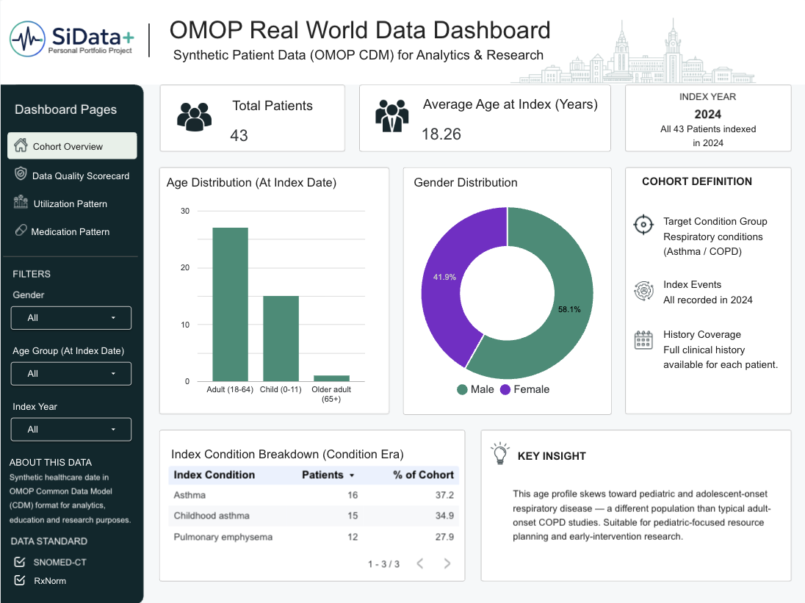
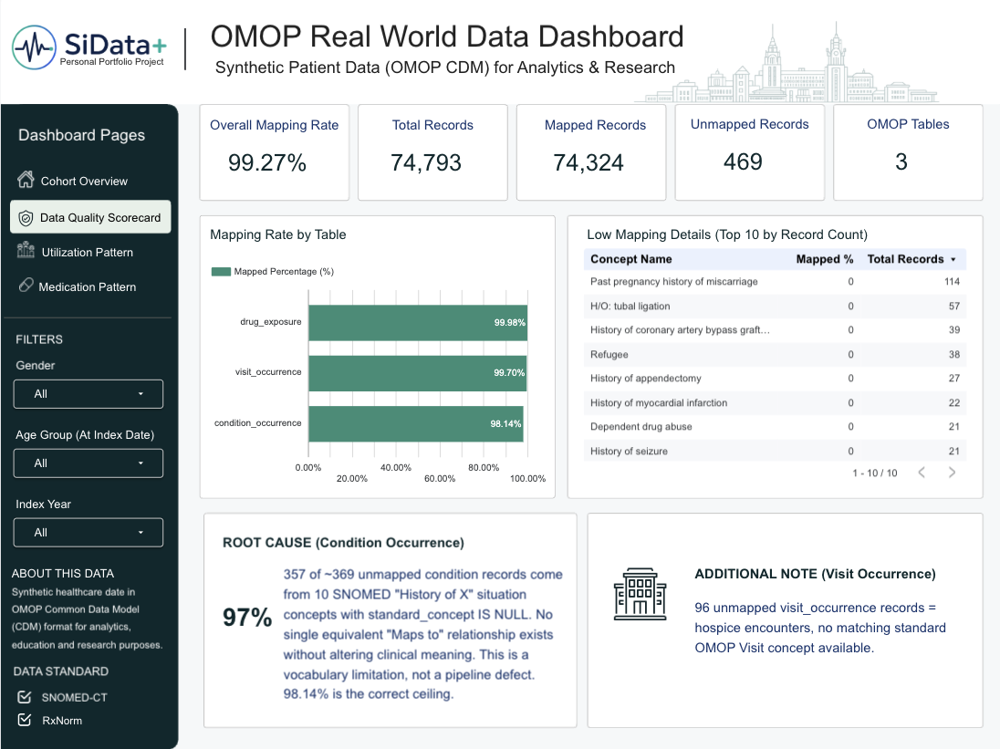
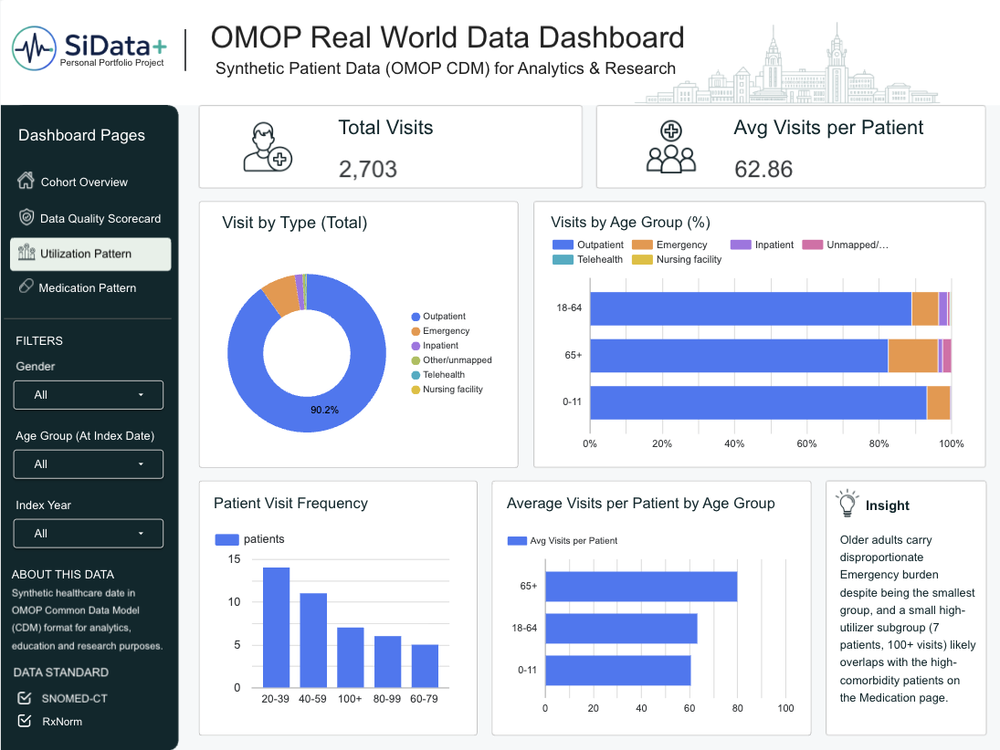
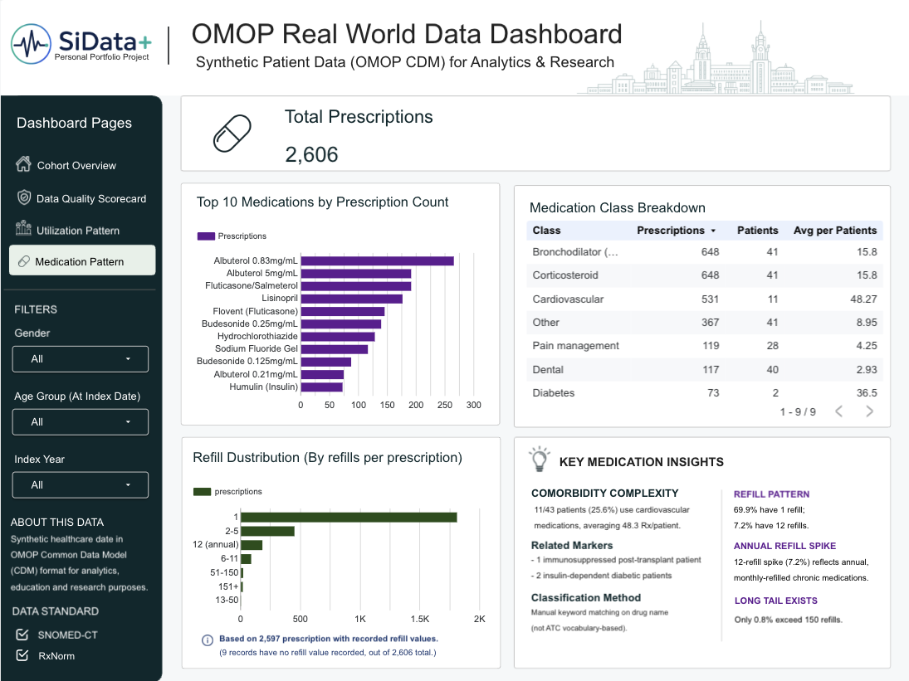

# Respiratory Disease Cohort Analytics — OMOP CDM Pipeline

A portfolio project demonstrating an end-to-end healthcare data pipeline:
synthetic patient data → OMOP Common Data Model → cohort analytics →
4-page BI dashboard, including a documented data-quality root-cause
investigation.

**Dashboard:** [Live Looker Studio dashboard](https://datastudio.google.com/reporting/f2ec889e-40e3-4ea4-9621-4c3bf26999ac)






## Why this project

Built to demonstrate familiarity with the tools and standards used in
hospital data teams (SQLMesh, OMOP CDM, OHDSI vocabularies), extended
with an analytics/dashboard layer aimed at non-technical stakeholders —
the piece that pure backend ETL demos typically stop short of.

## Architecture

```
Synthea (synthetic patient generator)
        ↓  raw CSV
PostgreSQL — raw schema
        ↓  SQLMesh staging models
staging schema (typed, standardized columns)
        ↓  SQLMesh OMOP models + OHDSI vocabulary lookup
omop schema (OMOP CDM v5.4: person, condition_occurrence,
             visit_occurrence, drug_exposure)
        ↓  cohort definition (concept_ancestor traversal)
cohort schema (respiratory_cohort: 43 asthma / COPD patients)
        ↓  export marts
CSV exports → Google Sheets → Looker Studio dashboard
```

## Data source

**Synthea** (Apache 2.0 license) — a synthetic patient generator. No real
patient data is used anywhere in this project. Clinical patterns
(disease incidence, treatment pathways) in Synthea are modeled on US
clinical guidelines, so this project should be read as a **technical
standards demo** (OMOP CDM, ETL, cohort analytics), not as a study of
Thai population health.

## Setup

Run in order — see `setup/` for full scripts:

1. `setup/01_setup_environment.sh` — Java, PostgreSQL, Python (Homebrew)
2. `setup/02_generate_synthea_data.sh` — generates a patient batch
   (start small to validate the pipeline end-to-end before scaling up)
3. `setup/03_setup_postgres_omop.sh` — creates the OMOP CDM v5.4 schema
   from the official OHDSI DDL. **Manual step required here:** register
   at [athena.ohdsi.org](https://athena.ohdsi.org), download the SNOMED
   + RxNorm vocabularies (this cannot be scripted — Athena requires a
   logged-in download), then run:
4. `setup/045_load_raw_synthea.sh` — loads the raw Synthea CSVs into
   `raw.*` tables (date columns are loaded as TEXT and safely cast in
   staging — Synthea occasionally emits implausible dates)
5. `setup/04_setup_sqlmesh.sh` — sets up the SQLMesh project
6. `setup/05_load_vocabulary.sh` — loads the downloaded SNOMED/RxNorm
   CSVs into the `omop` schema (tab-delimited — not comma)
7. Run `sqlmesh plan` / `sqlmesh apply` to build the staging + OMOP models
8. `setup/06_export_for_tableau.sh` — exports dashboard-ready marts to
   CSV (name is historical; output is used for the Looker Studio build)

## Cohort definition

`analysis/cohort_respiratory.sql` — defines the cohort using
`concept_ancestor` traversal from two anchor concepts (Asthma, COPD),
rather than hardcoding a fixed list of source codes. This follows the
standard OHDSI cohort-definition pattern and resulted in a 43-patient
cohort (16 Asthma, 15 Childhood asthma, 12 Pulmonary emphysema).

## Data quality — root-cause investigation

`analysis/data_quality_checks.sql` and `analysis/final_checks.sql` —
concept-mapping success rate, referential integrity, and date-logic
checks across all three OMOP fact tables (74,793 records total, 99.27%
mapped).

The 1.86% of `condition_occurrence` records that didn't map were
investigated rather than left unexplained: **357 of ~369 unmapped
records (97%) traced back to just 10 SNOMED source concepts**, all
"History of X" situation concepts (e.g. "History of appendectomy")
with `standard_concept IS NULL`. Checking `concept_relationship`
confirmed no `Maps to` relationship exists to a single equivalent
standard concept without altering clinical meaning ("history of" vs.
"currently undergoing") — this is a genuine SNOMED vocabulary
limitation, not a pipeline defect. 98.14% is the correct ceiling for
this table, not a bug to keep chasing.

## Dashboard

Built in **Looker Studio**, connected via Google Sheets (Looker Studio's
free tier doesn't support a live PostgreSQL connection from a local
machine without exposing the database to the internet — CSV export
avoids that entirely). Re-run `setup/06_export_for_tableau.sh` and
re-import to Google Sheets after any pipeline change to refresh the
dashboard.

Four pages:

1. **Cohort Overview** — demographics, age/gender distribution, index
   condition breakdown
2. **Data Quality Scorecard** — mapping rate by table, low-mapping
   concept detail, root-cause explanation
3. **Utilization Pattern** — visit type breakdown by age group, visit
   frequency distribution, average visits per patient
4. **Medication Pattern** — top medications, medication class
   breakdown, refill distribution

### Key findings

- **High-complexity comorbid subgroup:** only 11 of 43 patients (25.6%)
  carry cardiovascular medications, but they average 48.3
  prescriptions/patient — roughly 3× the cohort average — consistent
  with 1 immunosuppressed post-transplant patient and 2
  insulin-dependent diabetic patients also present in the cohort
- **High-utilizer subgroup:** 7 patients (16.3%) have 100+ recorded
  visits (up to 171), plausibly overlapping with the comorbid subgroup
  above
- **Age-related utilization pattern:** older adults (65+) show the
  highest Emergency visit share (13.8%) despite being the smallest age
  group; children (0-11) show the highest Outpatient share (93.2%) and
  near-zero Inpatient use

## Known limitations

- Synthetic data only — findings are illustrative, not epidemiological
  claims about any real population
- `person.race_concept_id` / `ethnicity_concept_id` mapping left as a
  TODO in `models/omop/person.sql` — intentionally not hardcoded since
  it requires a source-to-concept mapping decision
- Vocabulary loading is a manual step (Athena requires an account)
- Medication class grouping (`Bronchodilator`, `Cardiovascular`, etc.)
  is manual keyword matching on drug name, not an ATC-vocabulary-based
  classification
- Refill distribution and comorbidity summary are computed but not
  fully explored as dedicated dashboard pages — see
  `dashboard/exports/comorbidity_summary.csv` for the raw data